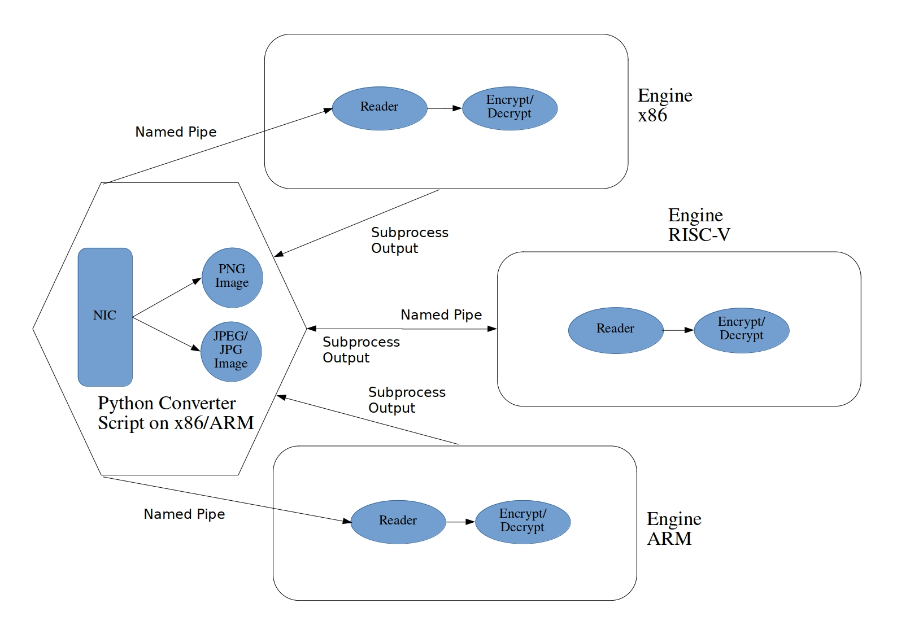

## A Performance Benchmark of Image Encryption Algorithms in RISC-V, ARM and x86

### Following is the test architecture that we propose:

### The test suit ha the following highlights:
* It has two main parts
	* Generator: A Python Script
	* Engine: A C compiled code
* The Generator is run on a well supported architecture
* The Engine is run on the target architecture
* The test can be run on any of the following inputs:
	* .mp4 video file
	* Webcam feed
	* IP webcam feed
	* .jpg/.png image file
* The engine is fed stream of pixel from generator via _named pipes_ as a subprocess of generator
* Engine returns encryption/decryption times to the parent generator process, which are analyzed statistically

### The following architectures were targeted for testing:
* ARM
* x86
* RISC-V (Using RV8 ISA Simulator)

### The following encryption algorithms were benchmarked:
* RC4
* Chirikov
* Vigenere

### The following sample resolutions were tested:
* 320x240
* 320x320
* 640x480
* 640x640
* 800x600
* 800x800
